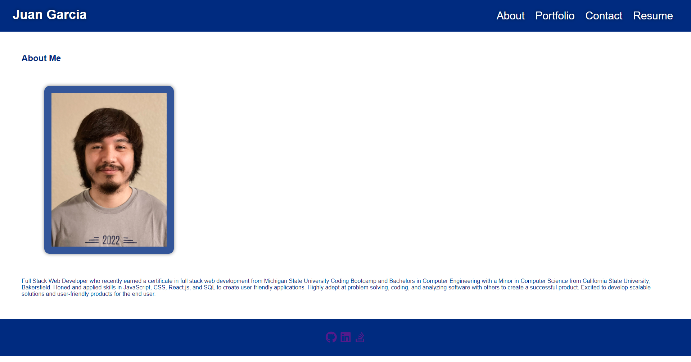

<h1 align="center"> React Challenge: React Portfolio </h1>

[](https://bootcamp.msu.edu/)


## Technologies


## Description
Developed a portfolio using React so that we can be set apart from other developers who don't use the latest technologies. The React portfolio will be deployed on GitHub Pages.

## Installation
***Requirments***

[React](https://reactjs.org/) | [Node.js](https://nodejs.org/en/)

***Once Installed:***
1. Clone the Repository on to your machine.
2. Open the terminal and ensure you are in the right file path.
3. Run the command ```npm install``` to download the packages.
4. Then run the command ```npm start``` to run the software.
5. The application will then begin to run locally.

## React Documentation
[React](./React.md)

## User Story
```
AS AN employer looking for candidates with experience building single-page applications
I WANT to view a potential employee's deployed React portfolio of work samples
SO THAT I can assess whether they're a good candidate for an open position
```

## Acceptance Criteria
```
GIVEN a single-page application portfolio for a web developer
WHEN I load the portfolio
THEN I am presented with a page containing a header, a section for content, and a footer
WHEN I view the header
THEN I am presented with the developer's name and navigation with titles corresponding to different sections of the portfolio
WHEN I view the navigation titles
THEN I am presented with the titles About Me, Portfolio, Contact, and Resume, and the title corresponding to the current section is highlighted
WHEN I click on a navigation title
THEN I am presented with the corresponding section below the navigation without the page reloading and that title is highlighted
WHEN I load the portfolio the first time
THEN the About Me title and section are selected by default
WHEN I am presented with the About Me section
THEN I see a recent photo or avatar of the developer and a short bio about them
WHEN I am presented with the Portfolio section
THEN I see titled images of six of the developer’s applications with links to both the deployed applications and the corresponding GitHub repository
WHEN I am presented with the Contact section
THEN I see a contact form with fields for a name, an email address, and a message
WHEN I move my cursor out of one of the form fields without entering text
THEN I receive a notification that this field is required
WHEN I enter text into the email address field
THEN I receive a notification if I have entered an invalid email address
WHEN I am presented with the Resume section
THEN I see a link to a downloadable resume and a list of the developer’s proficiencies
WHEN I view the footer
THEN I am presented with text or icon links to the developer’s GitHub and LinkedIn profiles, and their profile on a third platform (Stack Overflow, Twitter)
```

## Screenshot


## Link
A link to the [code](https://github.com/jgarcia45/react-portfolio):
```
https://github.com/jgarcia45/react-portfolio
```

A link to the [Deployed Application](https://jgarcia45.github.io/react-portfolio/):
```
https://jgarcia45.github.io/react-portfolio/
```

## License
Copyright (c) Juan Garcia. All rights reserved.

Licensed under the [MIT](LICENSE) license.